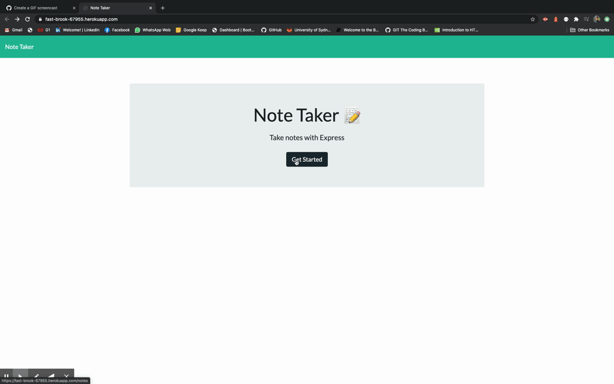

# Note Taker APP

  

  ## Description
  An responsive HTML webpage that displays an application that can be used to write, save, and delete notes. This application will use an express backend and save and retrieve note data from a JSON file.

  
  ## Table of contents
  
  * [Installation](#installation)
  * [Usage](#usage)
  * [License](#license)
  * [Contributing](#contributing)
  * [Tests](#tests)
  * [Questions](#questions)
  * [Screenshots](#screenshots)

  ## Installation

  This app has been deployed as a full stack web app on Heroku servers so all you need to do is navigate to the URL address of this app [here](https://fast-brook-67955.herokuapp.com/) and start using it.

  ## Usage
  This app lets the user to keep track of a lot of information by writing and saving notes. Each note includes a title and a text that could be saved by clicking the save button when the user finishes writing it. All the written notes will be displayed on a list at the left hand side of the app. The user can click on any note to take a look at it and each note also has a delete button to remove it from the list.

  ## License
  This project is licensed under the MIT.

  ## Contributing
  See [Questions](#Questions) section.

  ## Questions
  If you have any questions about the repo, open an issue or contact me directly at gguedesantonio@gmail.com. 
  You can find more about my work at [Github profile](https://github.com/guedesantonio). 

